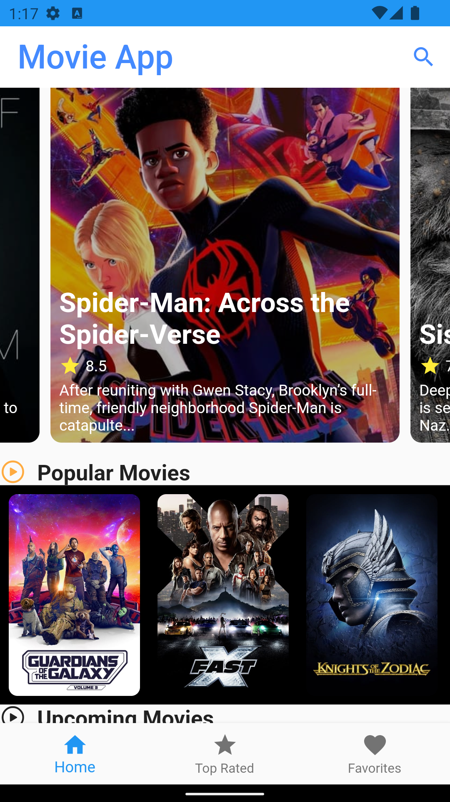
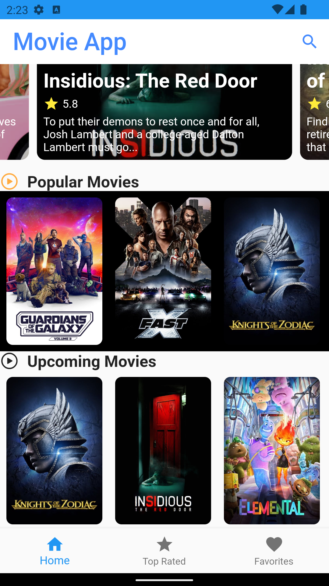
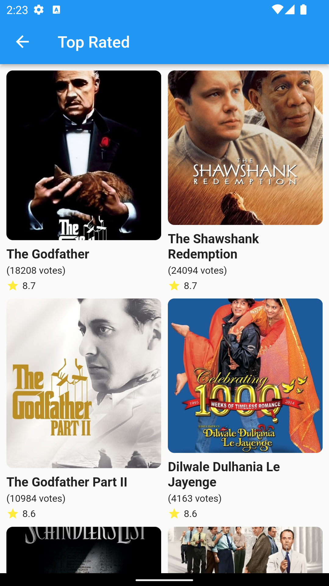
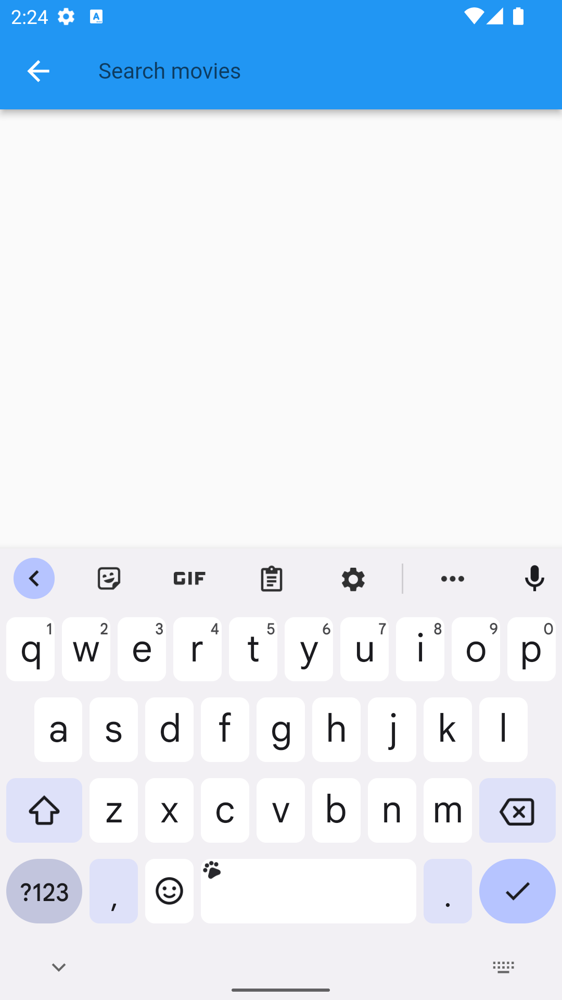
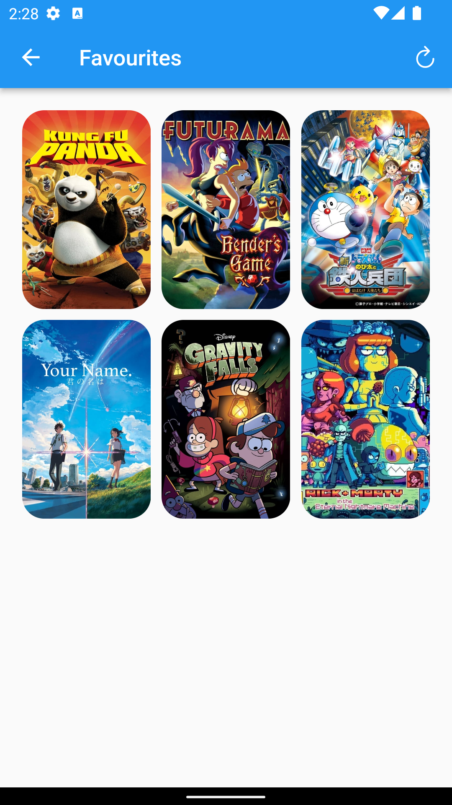
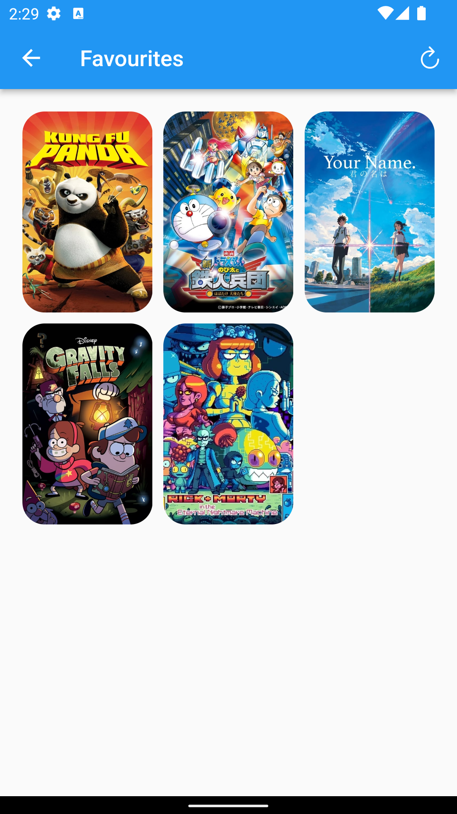

# Movie App

Movie App is a mobile app that allows users to browse and search for movies, view movie details, and save their favorite movies to a watchlist.

## Features

- Browse popular movies
- Search for movies by title
- View movie details, including synopsis, cast, and reviews
- Mark movies as favourite

## How to
   
home page contains a movie corousal of trending now movies,the horizontally scrollable list of 
popular and upcoming movies.

on clicking on top rated on bottom navigation bar ,it will take to this screen of top rated movies,

on clicking the search icon in the appbar of home screen

on entering movie name it fetches output.

 
on clicking any movie from any page,will open the details page which contains the details about a movie
and a favourite button to set movie as favourite
 
 on cliking favourite button a notification appears bottom
 

the favourite movies can be opened from homepage->favourite

a movie can be removed also

after removing

## Getting Started

To get started with Movie App, follow these steps:
1.download this

## Dependencies

Movie App uses the following dependencies:
-uses TMDB api for data
- http
- cached_network_image
- hive database (offline async database to store favourite movies)
-basic cupertino icon for heart

